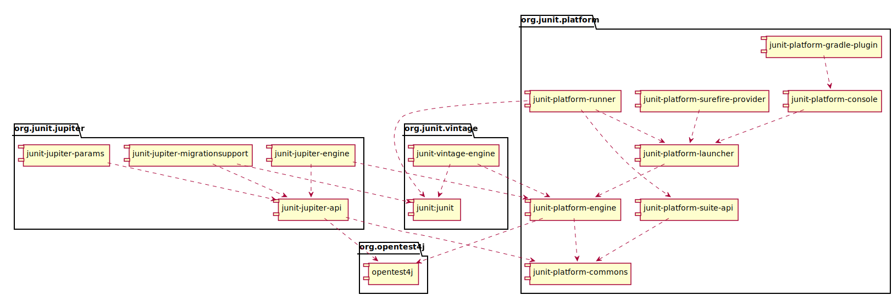

## 2. 安装

最终版本和里程碑都部署到Maven中心。  
快照构件被部署到[Sonatype](https://oss.sonatype.org/content/repositories/snapshots)的快照存储库\(在[/org/junit](https://oss.sonatype.org/content/repositories/snapshots/org/junit/)下\)。

### 2.1 mavne依赖项的说明

#### 2.1.1 JUnit Platform（平台）

* **Group ID:**
  org.junit.platform
* **Version:**
  1.0.2
* **Artifact IDs:**
  junit-platform-commons
    JUnit的内部公共库/实用程序。这些实用程序仅供JUnit框架本身使用。不支持外部的使用。不承担外部风险!

  junit-platform-console
    支持从控制台发现和执行JUnit平台上的测试。有关详细信息，请参见 [控制台启动程序](http://junit.org/junit5/docs/current/user-guide/#running-tests-console-launcher)。

  junit-platform-console-standalone
    junit-platform-console-standalone在Maven中心库包含所有依赖项的可执行JAR包。有关详细信息，请参见控制台启动程序。

  junit-platform-engine
    用于测试引擎的公共API。请参阅 [自己的测试引擎插件](http://junit.org/junit5/docs/current/user-guide/#launcher-api-engines-custom)信息。

  junit-platform-gradle-plugin
    支持在JUnit平台上使用[Gradle](http://junit.org/junit5/docs/current/user-guide/#running-tests-build-gradle)发现和执行测试。

  junit-platform-launcher
    配置和启动测试计划的公共API——通常由ide和构建工具使用。有关详细信息，请参见[JUnit平台启动API](http://junit.org/junit5/docs/current/user-guide/#launcher-api)。

  junit-platform-runner
    在JUnit 4环境中，在JUnit平台上执行测试和测试套件的Runner。有关详细信息，请参阅[使用JUnit 4运行JUnit平台](http://junit.org/junit5/docs/current/user-guide/#running-tests-junit-platform-runner)。

  junit-platform-suite-api
    在JUnit平台上配置测试套件的注解。由[JUnitPlatform runner](http://junit.org/junit5/docs/current/user-guide/#running-tests-junit-platform-runner)支持，可由第三方TestEngine实现支持。

  junit-platform-surefire-provider
    支持在JUnit平台上使用[Maven Surefire](http://junit.org/junit5/docs/current/user-guide/#running-tests-build-maven)发现和执行测试。

#### 2.1.2 JUnit Jupiter（朱庇特（主宰））

* **Group ID:**
  org.junit.jupiter
* **Version:**
  5.0.2
* **Artifact IDs:**

  junit-jupiter-api
  [编写测试](http://junit.org/junit5/docs/current/user-guide/#writing-tests)和[扩展](http://junit.org/junit5/docs/current/user-guide/#extensions)的JUnit Jupiter API。

  junit-jupiter-engine
    JUnit Jupiter 测试引擎实现，只在运行时需要。

  junit-jupiter-params
    支持JUnit Jupiter 的参数化测试。

  junit-jupiter-migrationsupport
    从JUnit 4到JUnit Jupiter的迁移支持，只需要运行选定的JUnit 4规则。

#### 2.1.3 JUnit Vintage（过时版、老版本）

* **Group ID:**
  org.junit.vintage
* **Version:**
  4.12.2
* **Artifact ID:**

  junit-vintage-engine
    JUnit老式测试引擎实现，允许运行老式的JUnit测试，即在新的JUnit平台上编写的JUnit 3或JUnit 4风格的测试。

#### 2.1.4 可选依赖关系

上述所有内容都有一个可选的依赖项，在其发布的Maven POMs上，在以下的@api Guardian JAR中。

* **Group ID:**
  org.apiguardian
* **Artifact ID:**
  apiguardian-api
* **Version:**
  1.0.0

## 2.2 依赖关系图

## 2.3 JUnit Jupiter 样本项目

junit5样本库托管了一组基于JUnit Jupiter和JUnit Vintage的示例项目的集合。您将找到 build.gradle 和 pom.xml 构建的下面的项目。

* 对于Gradle，请查看 [junit5 - Gradle - consumer](https://github.com/junit-team/junit5-samples/tree/r5.0.2/junit5-gradle-consumer) 项目。
* 对于Maven，请查看 [junit5 -maven- consumer](https://github.com/junit-team/junit5-samples/tree/r5.0.2/junit5-maven-consumer) 项目。

